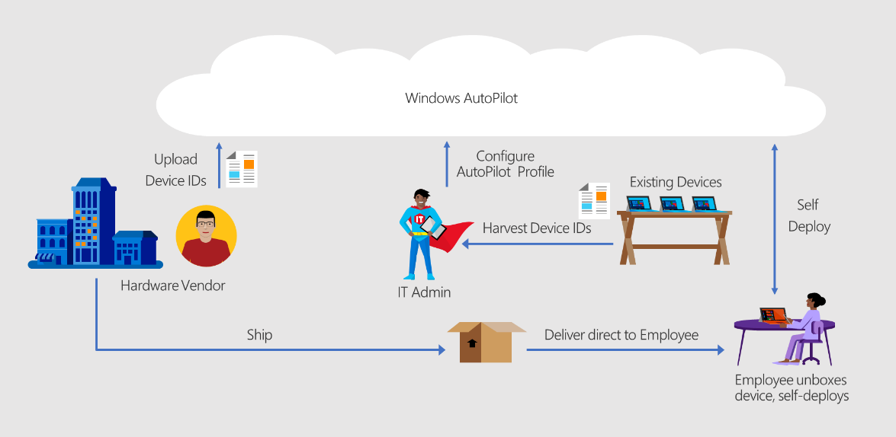

# Manual registration overview

*Applies to:*

- Windows 11
- Windows 10
- Windows Holographic, version 2004

Ideally, registration of a device with Windows Autopilot is performed by the OEM, reseller, or distributor from which the device was purchased. However it is also possible to register devices manually. You might need to register a device manually if:
- The device was obtained from a non-participant device manufacturer or reseller.
- The device is a virtual machine (VM).
- The device does not otherwise qualify for automatic registration, such as an existing legacy device.

The following diagram shows how you might use manual registration and OEM registration to deploy both new and existing devices with Windows Autopilot.

For a list of participant device manufacturers and device resellers, see [Autopilot device manufacturers and resellers](https://www.microsoft.com/microsoft-365/windows/windows-autopilot#office-SecondaryMessaging-k4if896).

To [manually register a device](add-devices.md), you must first capture its hardware hash. Once this process has completed, the resulting hardware hash can be uploaded to the Windows Autopilot service. Because this process requires booting the device into Windows to obtain the hardware hash, manual registration is intended primarily for testing and evaluation scenarios.

> [!Note]
> Customers can only register devices with a hardware hash. Other methods (PKID, tuple) are available through OEMs or CSP partners as described in the previous sections.

## Platforms for device registration

After the hardware hashes have been captured from existing devices, they can be uploaded in any of the following ways:

- [Microsoft Intune](add-devices.md). This is the preferred mechanism for all customers.
  - The Microsoft Intune admin center is used for Intune device enrollment.
- [Partner Center](https://msdn.microsoft.com/partner-center/autopilot). This is used by CSP partners to register devices on behalf of customers.
- [Microsoft 365 Business & Office 365 Admin](https://support.office.com/article/Create-and-edit-Autopilot-profiles-5cf7139e-cfa1-4765-8aad-001af1c74faa). This is typically used by small and medium businesses (SMBs) who manage their devices using Microsoft 365 Business.
- [Microsoft Store for Business](/microsoft-store/add-profile-to-devices#manage-autopilot-deployment-profiles). You might already be using Microsoft Store for Business to manage your apps and settings.

>[!IMPORTANT]
>Microsoft Store for Business and Microsoft Store for Education will be retired in the first quarter of 2023. You can continue to use the current capabilities of free apps until that time. For more information about this change, see [Evolving the Microsoft Store for Business and Education](https://techcommunity.microsoft.com/t5/windows-it-pro-blog/evolving-the-microsoft-store-for-business-and-education/ba-p/2569423).

A summary of each platform's capabilities is provided below.

| Platform/Portal | Register devices? | Create/Assign profile | Acceptable Device ID |
| --- | --- | -- | -- |
| OEM Direct API | YES - 1000 at a time max | NO | Tuple or PKID |
| [Partner Center](/partner-center/autopilot) | YES - 1000 at a time max | YES3 | Tuple or PKID or 4K HH |
| [Intune](add-devices.md) | YES - 500 at a time max | YES12 | 4K HH |
| [Microsoft Store for Business](/microsoft-store/add-profile-to-devices#manage-autopilot-deployment-profiles) | YES - 1000 at a time max | YES4 | 4K HH |
| [Microsoft 365 Business Premium](/microsoft-365/business/create-and-edit-autopilot-profiles) | YES - 1000 at a time max | YES3 | 4K HH |

><b>1</b>Microsoft recommended platform to use 
><b>2</b>Intune license required 
><b>3</b>Feature capabilities are limited 
><b>4</b>Device profile assignment will be retired from Microsoft Store for Business in the coming months 

For more information about device IDs, see the following topics:
- [Device identification](registration-overview.md#device-identification)
- [Windows Autopilot device guidelines](autopilot-device-guidelines.md)
- [Add devices to a customer account](/partner-center/autopilot)

## Also see

[Registration overview](registration-overview.md) 
[Manually register devices with Windows Autopilot](add-devices.md)
